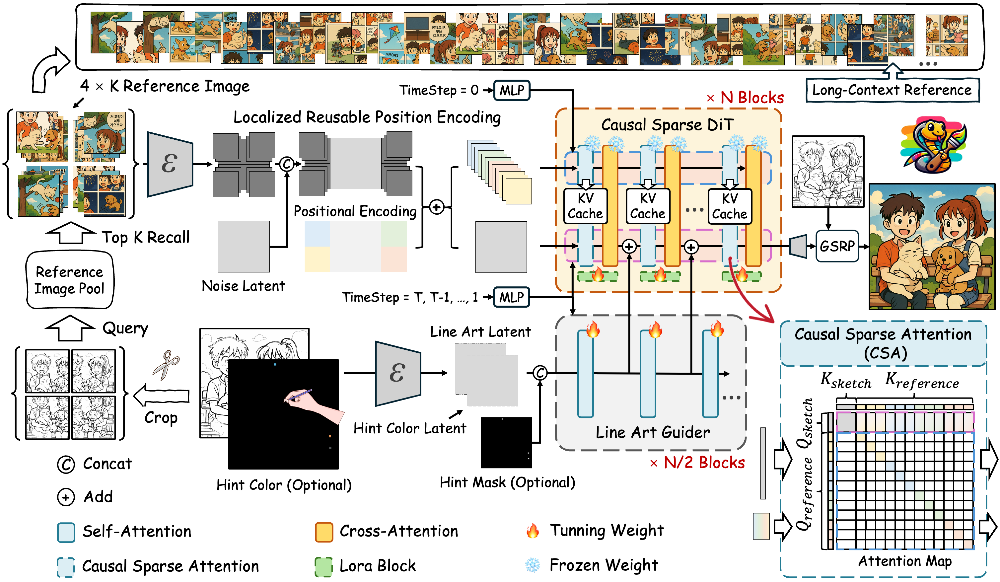
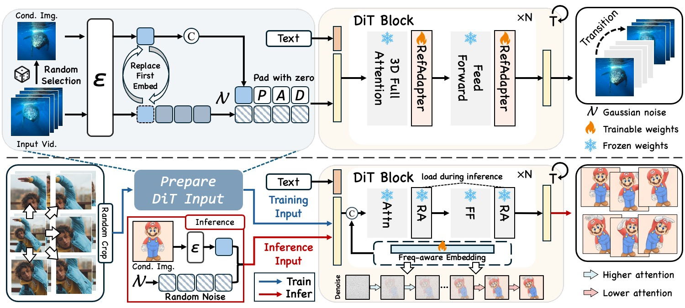
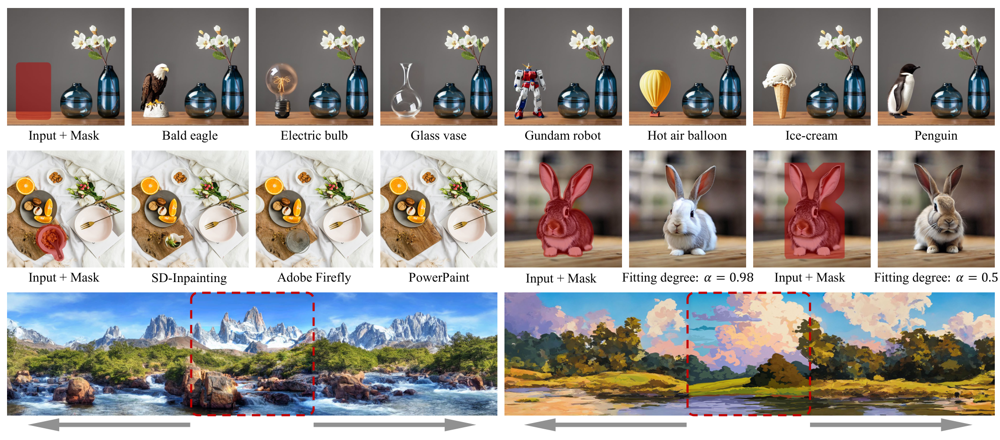
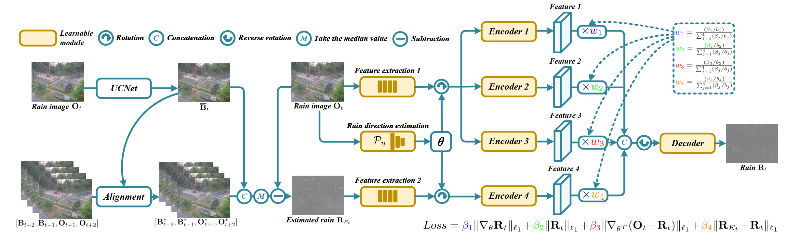
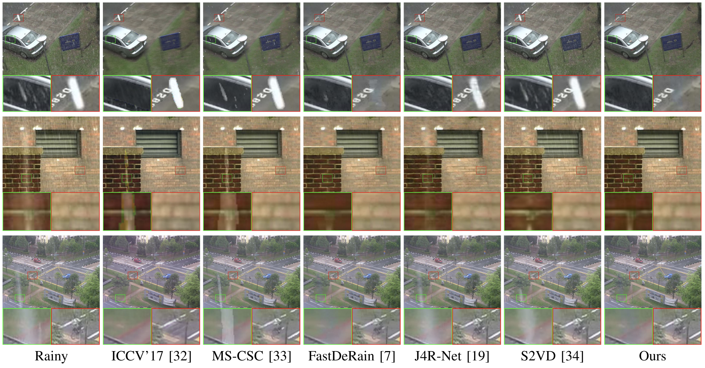
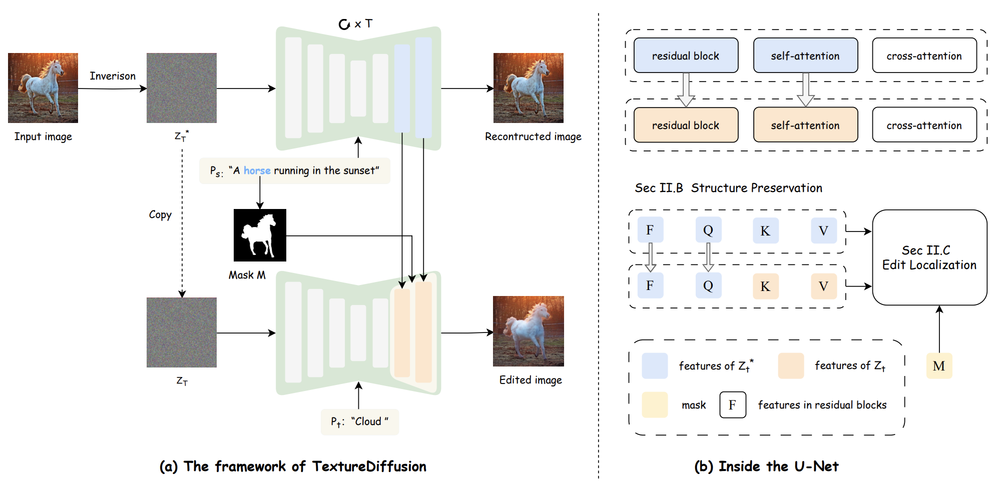
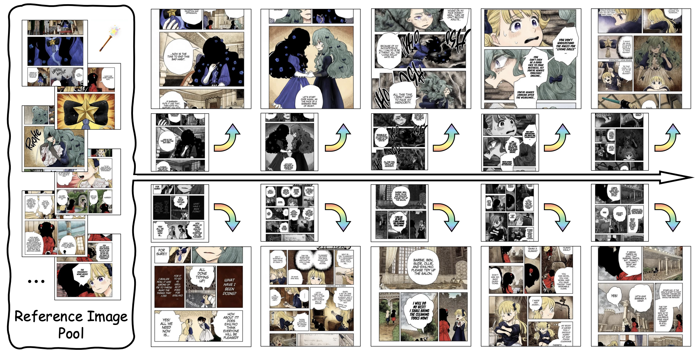

I am currently a second-year Master's student in Computer Technology at Tsinghua University, under the supervision of Prof. [Chun Yuan](https://scholar.google.com/citations?user=fYdxi2sAAAAJ&hl=en). I obtained my Bachelor's degree in Computer Science and Technology from the Yingcai Honors College at the University of Electronic Science and Technology of China in 2023.

My research interests lie in Computer Vision, particularly in image and video generation.

[Email](mailto:zhuangjh23@mails.tsinghua.edu.cn) / [Github](https://github.com/zhuang2002)

---
# ✨ News
---
* 2025-04: Two papers are accepted to [SIGGRAPH 2025](https://www.siggraph.org/siggraph-events/conferences/)
* 2024-07: One paper is accepted to [ECCV 2024](https://eccv.ecva.net/)
* 2024-03: One paper is accepted to [ACM MM 2022](https://2022.acmmm.org/)

---
# 🔬 Research
---
* indicates equal contribution
<table style="width:100%;border:0px;border-spacing:0px;border-collapse:separate;margin-right:auto;margin-left:auto;"><tbody>	

  <!--Cobra-->
  <tr>
    <td style="padding:20px;width:30%;max-width:30%" align="center">
      
    </td>
    <td width="75%" valign="center">
      <papertitle>Cobra: Efficient Line Art COlorization with BRoAder References</papertitle>
       
      <b>Junhao Zhuang</b>, Lingen Li, Xuan Ju, Zhaoyang Zhang, Chun Yuan and Ying Shan
       
      <em>ACM SIGGRAPH (<strong>SIGGRAPH</strong>), 2025</em>
       
      <a href="https://zhuang2002.github.io/Cobra/">[Project Page]</a>
      <a href="https://github.com/zhuang2002/Cobra">[Code]</a> 
       
      
 Cobra is a novel efficient long-context fine-grained ID preservation framework for line art colorization, achieving high precision, efficiency, and flexible usability for comic colorization. By effectively integrating extensive contextual references, it transforms black-and-white line art into vibrant illustrations.

    </td>
  </tr>	

  <!--FlexiAct-->
  <tr>
    <td style="padding:20px;width:30%;max-width:30%" align="center">
      
    </td>
    <td width="75%" valign="center">
      <papertitle>FlexiAct: Towards Flexible Action Control in Heterogeneous Scenarios</papertitle>
       
      Shiyi Zhang*, <b>Junhao Zhuang*</b>, Zhaoyang Zhang, Yansong Tang
       
      <em>ACM SIGGRAPH (<strong>SIGGRAPH</strong>), 2025</em>
<!--        
      <a href="">[PDF]</a>
      <a href="https://github.com/shiyi-zh0408/NAE_CVPR2024">[Project Page]</a> 
        -->
      
 We achieve action transfer in heterogeneous scenarios with varying spatial structures or cross-domain subjects.

    </td>
  </tr>	

  <!--PowerPaint-->
  <tr>
    <td style="padding:20px;width:30%;max-width:30%" align="center">
      
    </td>
    <td width="75%" valign="center">
      <papertitle>A Task is Worth One Word: Learning with Task Prompts for High-Quality Versatile Image Inpainting</papertitle>
       
      <b>Junhao Zhuang</b>, Yanhong Zeng, Wenran Liu, Chun Yuan, Kai Chen
       
      <em>European Conference on Computer Vision (<strong>ECCV</strong>)</em>, 2024
       
      <a href="https://arxiv.org/abs/2312.03594">[PDF]</a>
      <a href="https://powerpaint.github.io/">[Project Page]</a> 
       
      
 PowerPaint is the first versatile image inpainting model that simultaneously achieves state-of-the-art results in various inpainting tasks such as text-guided object inpainting, context-aware image inpainting, shape-guided object inpainting with controllable shape-fitting, and outpainting.

    </td>
  </tr>	

  <!--UConNet-->
  <tr>
    <td style="padding:20px;width:30%;max-width:30%" align="center">
      
    </td>
    <td width="75%" valign="center">
      <papertitle>UConNet: Unsupervised controllable network for image and video deraining</papertitle>
       
      <b>Junhao Zhuang</b>, Yisi Luo, Xile Zhao, Taixiang Jiang, Bichuan Guo
       
      <em>ACM Multimedia Conference (<strong>ACM MM</strong>)</em>, 2022
       
      <a href="https://dl.acm.org/doi/10.1145/3503161.3547772">[PDF]</a>
      <a href="https://github.com/zhuang2002/UConNet">[Code]</a> 
       
      
 We propose the UConNet for image and video deraining. Our UConNet learns a relationship between trade-off parameters of the loss function and weightings of feature maps. At the inference stage, the weightings can be adaptively controlled to handle different rain scenarios, resulting in high generalization abilities. Extensive experimental results validate the effectiveness, generalization abilities, and efficiency of UConNet. 

    </td>
  </tr>	

  <!--derain-->
  <tr>
    <td style="padding:20px;width:30%;max-width:30%" align="center">
      
    </td>
    <td width="75%" valign="center">
      <papertitle>Reconciling hand-crafted and self-supervised deep priors for video directional rain streaks removal</papertitle>
       
      <b>Junhao Zhuang</b>, Yisi Luo, Xile Zhao, Taixiang Jiang
       
      <em>IEEE Signal Processing Letters (<strong>IEEE SPL</strong>)</em>
       
      <a href="http://ieeexplore.ieee.org/document/9576626">[PDF]</a>
       
      
 we propose to reconcile the learned gradient prior, the temporal local smooth prior, the sparse prior, and the self-supervised deep prior for video directional rain streaks removal. To address the resulting model, we introduce an ADMM algorithm.

    </td>
  </tr>	

  <!--TextureDiffusion-->
  <tr>
    <td style="padding:20px;width:30%;max-width:30%" align="center">
      
    </td>
    <td width="75%" valign="center">
      <papertitle>TextureDiffusion: Target Prompt Disentangled Editing for Various Texture Transfer</papertitle>
       
      Zihan Su, <b>Junhao Zhuang</b>, Chun Yuan
       
      <em>International Conference on Acoustics, Speech, and Signal Processing (<strong>ICASSP</strong>), 2024, Oral</em>
       
      <a href="https://arxiv.org/pdf/2409.09610">[PDF]</a>
      <a href="https://github.com/THU-CVML/TextureDiffusion">[Project Page]</a> 
       
      
 We proposed TextureDiffusion, a tuning-free image editing method applied to various texture transfer. 

    </td>
  </tr>	

  <!--ColorFlow-->
  <tr>
    <td style="padding:20px;width:30%;max-width:30%" align="center">
      
    </td>
    <td width="75%" valign="center">
      <papertitle>ColorFlow: Retrieval-Augmented Image Sequence Colorization</papertitle>
       
      <b>Junhao Zhuang</b>, Xuan Ju, Zhaoyang Zhang, Yong Liu, Shiyi Zhang, Chun Yuan, Ying Shan
       
      <em>International Conference on Acoustics, Speech, and Signal Processing (<strong>ICASSP</strong>), 2024, Oral</em>
       
      <a href="https://arxiv.org/abs/2412.11815">[PDF]</a>
      <a href="https://zhuang2002.github.io/ColorFlow/">[Project Page]</a> 
       
      
 ColorFlow is the first model designed for fine-grained ID preservation in image sequence colorization, utilizing contextual information. Given a reference image pool, ColorFlow accurately generates colors for various elements in black and white image sequences, including the hair color and attire of characters, ensuring color consistency with the reference images.  

    </td>
  </tr>	

</tbody></table>

