

I am currently a *Researcher* at *JD Future Academy, JD.com*, as a member of the *Tech Genius Team (TGT)*.

I received my Master's degree in Computer Technology from *Tsinghua University*, under the supervision of *Prof. Chun Yuan*. I obtained my Bachelor's degree in Computer Science and Technology from the *Yingcai Honors College at the University of Electronic Science and Technology of China* in 2023, where I was fortunate to be advised by *Prof. Xile Zhao*.

Previously, I worked as a *Research Assistant* at *MMLab, The Chinese University of Hong Kong (CUHK)*, under the supervision of *Prof. Tianfan Xue*.

My research focuses on large-scale audio-visual generative models and interactive
world models for games and real-world environments.

[Email](mailto:zhuangjh23@tsinghua.org.cn) / [GitHub](https://github.com/zhuang2002)

---
# ✨ News
---
* 2026-05: Two papers are accepted to [SIGGRAPH Asia 2026](https://asia.siggraph.org/2026/)
* 2026-05: One paper is accepted to [ECCV 2026](https://eccv.ecva.net/)
* 2026-05: One paper is accepted to [ICML 2026](https://icml.cc/)
* 2026-05: One paper is accepted to [IEEE TPAMI](https://www.computer.org/csdl/journal/tp)
* 2026-02: One paper is accepted to [CVPR 2026](https://cvpr.thecvf.com/)
* 2025-09: One paper is accepted to [NeurIPS 2025](https://neurips.cc/)
* 2025-04: Two papers are accepted to [SIGGRAPH 2025](https://www.siggraph.org/siggraph-events/conferences/)
* 2024-12: One paper is accepted to [ICASSP 2025](https://2025.ieeeicassp.org/important-dates/)
* 2024-07: One paper is accepted to [ECCV 2024](https://eccv.ecva.net/)
* 2022-06: One paper is accepted to [ACM MM 2022](https://2022.acmmm.org/)

---
# 🔬 Research
---
\* indicates equal contribution
<table style="width:100%;border:0px;border-spacing:0px;border-collapse:separate;margin-right:auto;margin-left:auto;"><tbody>	

<!--EchoWM-->
<tr>
  <td style="padding:20px;width:30%;max-width:30%" align="center">
    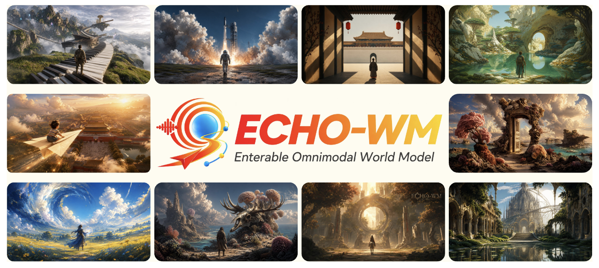
  </td>
  <td width="75%" valign="center">
    <papertitle>EchoWM: Open and Enterable Omnimodal World Models</papertitle>
     
    Songchun Zhang*, Yaowei Li*, <b>Junhao Zhuang*</b>, Weiyang Jin*,
    Haoyu Wang, Xin Lu, Shiyi Zhang, Haoran Li, Xiaoxiao Ma, Yumin Li,
    Yijun Liu, Yaofeng Su, Yanwen Ma, Haoyu Wu, Zihan Su, Yue Ma,
    Lvmin Zhang, Haoyang Huang, Zeyue Xue, Anyi Rao, Nan Duan
     
    <em>Technical Report</em>, 2026
     
    <a href="https://github.com/jd-opensource/JoyAI-Echo">[Code]</a>
     
    
    
    

      An omnimodal world model for generative media that responds to continuous
      navigation while video, environmental sound, music, and speech evolve
      together. I proposed <strong>Short-Horizon and Long-Horizon Audio-Visual
      Self-Gradient Forcing</strong> and was responsible for EchoWM’s
      <strong>causal training</strong>.
    

  </td>
</tr>

<!--SGF-->
<tr>
  <td style="padding:20px;width:30%;max-width:30%" align="center">
    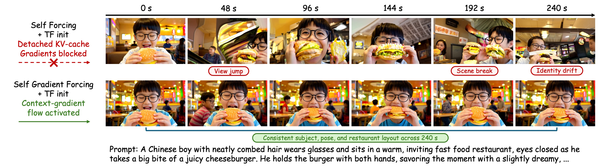
  </td>
  <td width="75%" valign="center">
    <papertitle>Self Gradient Forcing: Native Long Video Extrapolation</papertitle>
     
    <b>Junhao Zhuang</b>, Shiyi Zhang, Yuxuan Bian, Yaowei Li,
    Yawen Luo, Weiyang Jin, Songchun Zhang, et al.
     
    <em>Technical Report</em>
     
    <a href="https://arxiv.org/abs/2607.20368">[PDF]</a>
    <a href="https://zhuang2002.github.io/SelfGradientForcing/">[Project Page]</a>
    <a href="https://github.com/zhuang2002/Self_Gradient_Forcing">[Code]</a>
     
    
    
    

      Self Gradient Forcing (SGF) recovers the missing context-gradient path
      for self-generated causal memory through a bounded two-pass replay,
      enabling models trained with only a 5-second window to extrapolate to
      minute-scale videos with stronger identity, layout, and temporal
      stability. It also supports the causal training of
      <strong>EchoWM</strong>.
    

  </td>
</tr>

<!--Joyai Echo-->
<tr>
  <td style="padding:20px;width:30%;max-width:30%" align="center">
    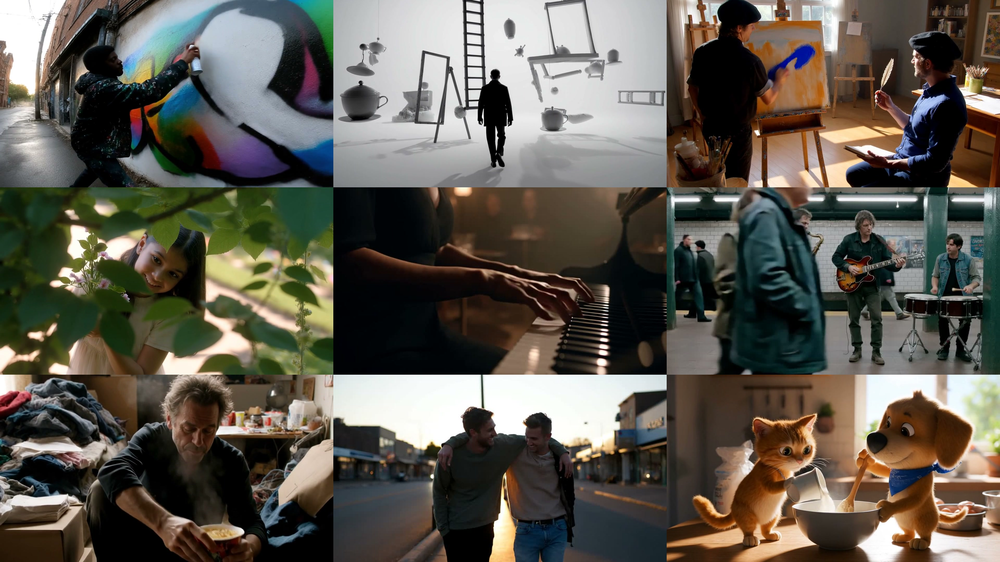
  </td>
  <td width="75%" valign="center">
    <papertitle>JoyAI-Echo: Pushing the Frontier of Long Audio-Visual Generation</papertitle>
     
    Echo Team
     
    <em>Technical Report</em>
     
    <a href="https://www.researchgate.net/publication/405770309_JoyAI-Echo_Pushing_the_Frontier_of_Long_Audio-Visual_Generation">[PDF]</a> 
    <a href="https://echo-team-joy-future-academy-jd.github.io/Echo-LongVideo-Page/">[Project Page]</a>
    <a href="https://github.com/jd-opensource/JoyAI-Echo">[Code]</a>
     
    
    
    
 JoyAI-Echo is an interactive long video generation framework with boosted speed, stable audio-visual consistency and real-time editing, outperforming baseline models.

  </td>
</tr>	

<!--shotstream-->
<tr>
  <td style="padding:20px;width:30%;max-width:30%" align="center">
    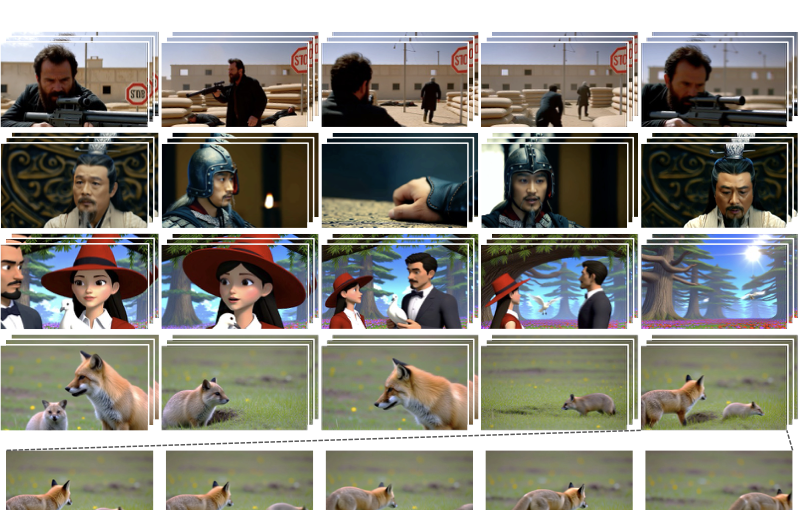
  </td>
  <td width="75%" valign="center">
    <papertitle>ShotStream: Streaming Multi-Shot Video Generation for Interactive Storytelling</papertitle>
     
    Yawen Luo, Xiaoyu Shi, <b>Junhao Zhuang</b>, Yutian Chen, Quande Liu, Xintao Wang, Pengfei Wan, Tianfan Xue
     
    <em>European Conference on Computer Vision (<strong>ECCV</strong>)</em>, 2026
     
    <a href="https://arxiv.org/pdf/2603.25746">[PDF]</a> 
    <a href="https://luo0207.github.io/ShotStream/">[Project Page]</a>
    <a href="https://github.com/KlingAIResearch/ShotStream">[Code]</a>
     
    
    
    
 ShotStream is a novel causal multi-shot architecture that enables interactive storytelling and efficient on-the-fly frame generation, achieving 16 FPS on a single NVIDIA GPU.

  </td>
</tr>	

<!--FlashVSR-->
<tr>
  <td style="padding:20px;width:30%;max-width:30%" align="center">
    
  </td>
  <td width="75%" valign="center">
    <papertitle>FlashVSR: Towards Real-Time Diffusion-Based Streaming Video Super-Resolution</papertitle>
     
    <b>Junhao Zhuang</b>, Shi Guo, Xin Cai, Xiaohui Li, Yihao Liu, Chun Yuan and Tianfan Xue
     
    <em>Conference on Computer Vision and Pattern Recognition (<strong>CVPR</strong>), 2026</em>
     
    <a href="https://arxiv.org/abs/2510.12747">[PDF]</a> 
    <a href="https://zhuang2002.github.io/FlashVSR/">[Project Page]</a>
    <a href="https://github.com/OpenImagingLab/FlashVSR">[Code]</a>
     
    
    
    
 FlashVSR is a streaming, one-step diffusion-based video super-resolution framework with block-sparse attention and a Tiny Conditional Decoder. It reaches ~17 FPS at 768×1408 on a single A100 GPU. A Locality-Constrained Attention design further improves generalization and perceptual quality on ultra-high-resolution videos.

  </td>
</tr>	

<!--Cobra-->
<tr>
  <td style="padding:20px;width:30%;max-width:30%" align="center">
    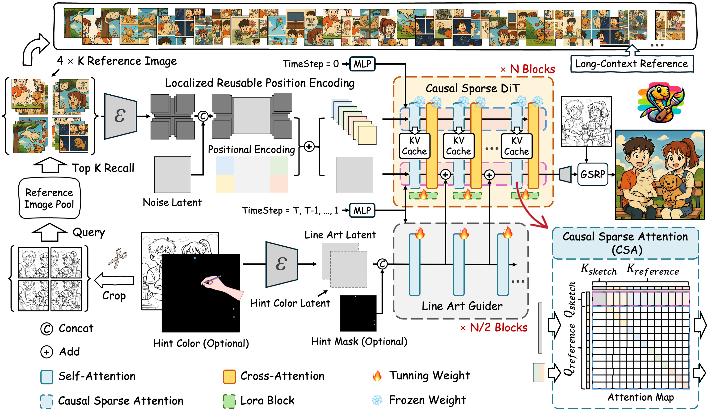
  </td>
  <td width="75%" valign="center">
    <papertitle>Cobra: Efficient Line Art COlorization with BRoAder References</papertitle>
     
    <b>Junhao Zhuang</b>, Lingen Li, Xuan Ju, Zhaoyang Zhang, Chun Yuan and Ying Shan
     
    <em>ACM SIGGRAPH (<strong>SIGGRAPH</strong>), 2025</em>
     
    <a href="https://arxiv.org/abs/2504.12240">[PDF]</a> 
    <a href="https://zhuang2002.github.io/Cobra/">[Project Page]</a>
    <a href="https://github.com/Zhuang2002/Cobra">[Code]</a>
     
    
    
    
 Cobra is a novel efficient long-context fine-grained ID preservation framework for line art colorization, achieving high precision, efficiency, and flexible usability for comic colorization. By effectively integrating extensive contextual references, it transforms black-and-white line art into vibrant illustrations.

  </td>
</tr>	

<!--FlexiAct-->
<tr>
  <td style="padding:20px;width:30%;max-width:30%" align="center">
    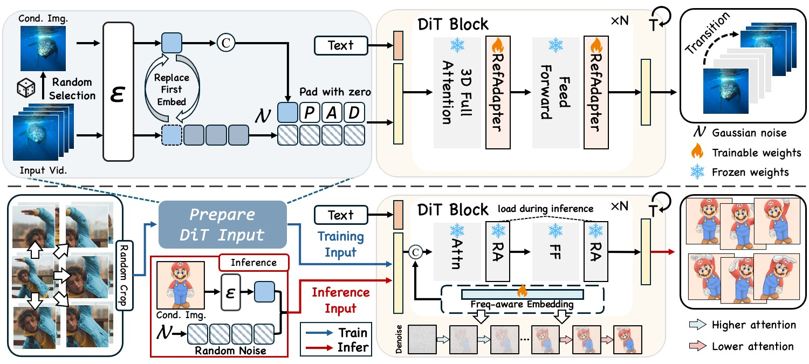
  </td>
  <td width="75%" valign="center">
    <papertitle>FlexiAct: Towards Flexible Action Control in Heterogeneous Scenarios</papertitle>
     
    Shiyi Zhang*, <b>Junhao Zhuang*</b>, Zhaoyang Zhang, Yansong Tang
     
    <em>ACM SIGGRAPH (<strong>SIGGRAPH</strong>), 2025</em>
     
    <a href="https://arxiv.org/abs/2505.03730">[PDF]</a> 
    <a href="https://shiyi-zh0408.github.io/projectpages/FlexiAct/">[Project Page]</a>
    <a href="https://github.com/shiyi-zh0408/FlexiAct">[Code]</a>
     
    
    
    
 We achieve action transfer in heterogeneous scenarios with varying spatial structures or cross-domain subjects.

  </td>
</tr>	

<!--PowerPaint-->
<tr>
  <td style="padding:20px;width:30%;max-width:30%" align="center">
    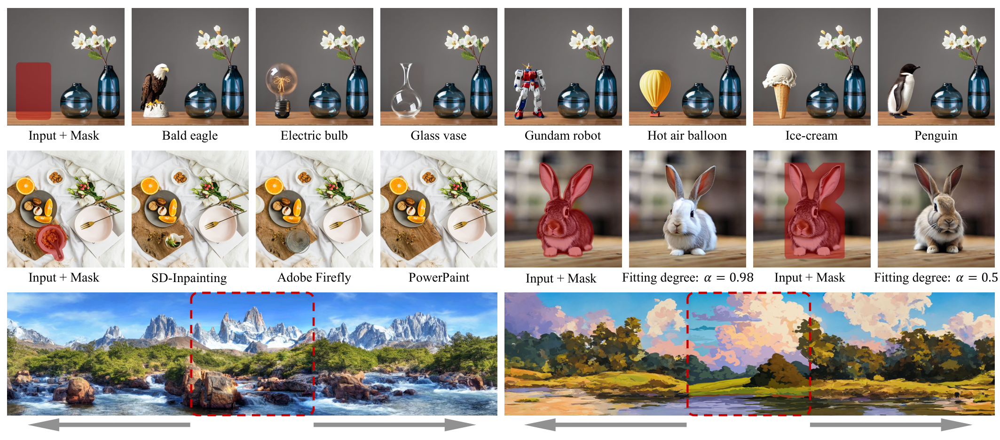
  </td>
  <td width="75%" valign="center">
    <papertitle>A Task is Worth One Word: Learning with Task Prompts for High-Quality Versatile Image Inpainting</papertitle>
     
    <b>Junhao Zhuang</b>, Yanhong Zeng, Wenran Liu, Chun Yuan, Kai Chen
     
    <em>European Conference on Computer Vision (<strong>ECCV</strong>)</em>, 2024
     
    <a href="https://arxiv.org/abs/2312.03594">[PDF]</a>
    <a href="https://powerpaint.github.io/">[Project Page]</a> 
    <a href="https://github.com/open-mmlab/PowerPaint">[Code]</a>
     
    
    
    
 PowerPaint is the first versatile image inpainting model that simultaneously achieves state-of-the-art results in various inpainting tasks such as text-guided object inpainting, context-aware image inpainting, shape-guided object inpainting with controllable shape-fitting, and outpainting.

  </td>
</tr>	

<!--UConNet-->
<tr>
  <td style="padding:20px;width:30%;max-width:30%" align="center">
    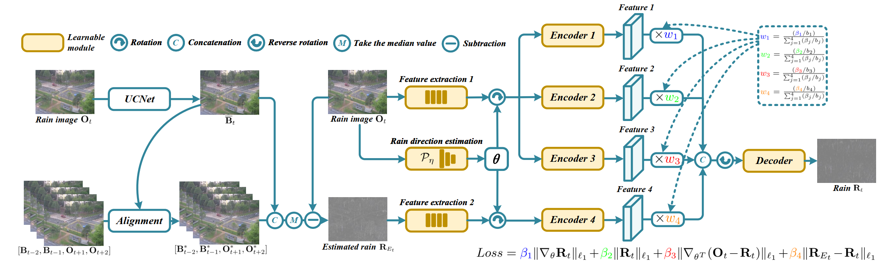
  </td>
  <td width="75%" valign="center">
    <papertitle>UConNet: Unsupervised controllable network for image and video deraining</papertitle>
     
    <b>Junhao Zhuang</b>, Yisi Luo, Xile Zhao, Taixiang Jiang, Bichuan Guo
     
    <em>ACM Multimedia Conference (<strong>ACM MM</strong>)</em>, 2022
     
    <a href="https://dl.acm.org/doi/10.1145/3503161.3547772">[PDF]</a>
    <a href="https://github.com/zhuang2002/UConNet">[Code]</a> 
     
    
 We propose the UConNet for image and video deraining. Our UConNet learns a relationship between trade-off parameters of the loss function and weightings of feature maps. At the inference stage, the weightings can be adaptively controlled to handle different rain scenarios, resulting in high generalization abilities. Extensive experimental results validate the effectiveness, generalization abilities, and efficiency of UConNet. 

  </td>
</tr>	

<!--TextureDiffusion-->
<tr>
  <td style="padding:20px;width:30%;max-width:30%" align="center">
    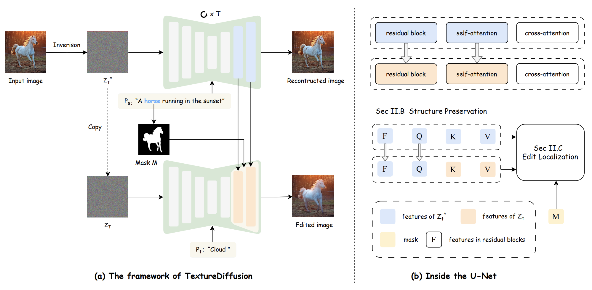
  </td>
  <td width="75%" valign="center">
    <papertitle>TextureDiffusion: Target Prompt Disentangled Editing for Various Texture Transfer</papertitle>
     
    Zihan Su, <b>Junhao Zhuang</b>, Chun Yuan
     
    <em>International Conference on Acoustics, Speech, and Signal Processing (<strong>ICASSP</strong>), 2024, Oral</em>
     
    <a href="https://arxiv.org/pdf/2409.09610">[PDF]</a>
    <a href="https://github.com/THU-CVML/TextureDiffusion">[Code]</a> 
     
    
 We proposed TextureDiffusion, a tuning-free image editing method applied to various texture transfer. 

  </td>
</tr>	

<!--ColorFlow-->
<tr>
  <td style="padding:20px;width:30%;max-width:30%" align="center">
    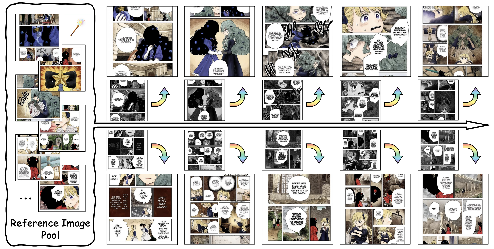
  </td>
  <td width="75%" valign="center">
    <papertitle>ColorFlow: Retrieval-Augmented Image Sequence Colorization</papertitle>
     
    <b>Junhao Zhuang*</b>, Xuan Ju*, Zhaoyang Zhang, Yong Liu, Shiyi Zhang, Chun Yuan, Ying Shan
     
    <em>arXiv preprint arXiv:2412.11815, 2024</em>
     
    <a href="https://arxiv.org/abs/2412.11815">[PDF]</a>
    <a href="https://zhuang2002.github.io/ColorFlow/">[Project Page]</a> 
    <a href="https://github.com/TencentARC/ColorFlow">[Code]</a>
     
    
    
    
 ColorFlow is the first model designed for fine-grained ID preservation in image sequence colorization, utilizing contextual information. Given a reference image pool, ColorFlow accurately generates colors for various elements in black and white image sequences, including the hair color and attire of characters, ensuring color consistency with the reference images.  

  </td>
</tr>	

<!--Safe-Sora-->
<tr>
  <td style="padding:20px;width:30%;max-width:30%" align="center">
    
  </td>
  <td width="75%" valign="center">
    <papertitle>Safe-Sora: Safe Text-to-Video Generation via Graphical Watermarking</papertitle>
     
    Zihan Su, Xuerui Qiu, Hongbin Xu, Tangyu Jiang, <b>Junhao Zhuang</b>, Chun Yuan, Ming Li, Shengfeng He, Fei Richard Yu
     
    <em>Neural Information Processing Systems (<strong>NeurIPS</strong>), 2025</em>
     
    <a href="https://arxiv.org/pdf/2505.12667">[PDF]</a> 
    <a href="https://sugewud.github.io/Safe-Sora-project/">[Project Page]</a>
    <a href="https://github.com/Sugewud/Safe-Sora">[Code]</a>
     
    
 Safe-Sora: a framework for embedding graphical watermarks into video generation, achieving state-of-the-art quality, fidelity, and robustness through hierarchical adaptive matching and a 3D wavelet-enhanced Mamba architecture.

  </td>
</tr>	

<!--BrushEdit-->
<tr>
  <td style="padding:20px;width:30%;max-width:30%" align="center">
    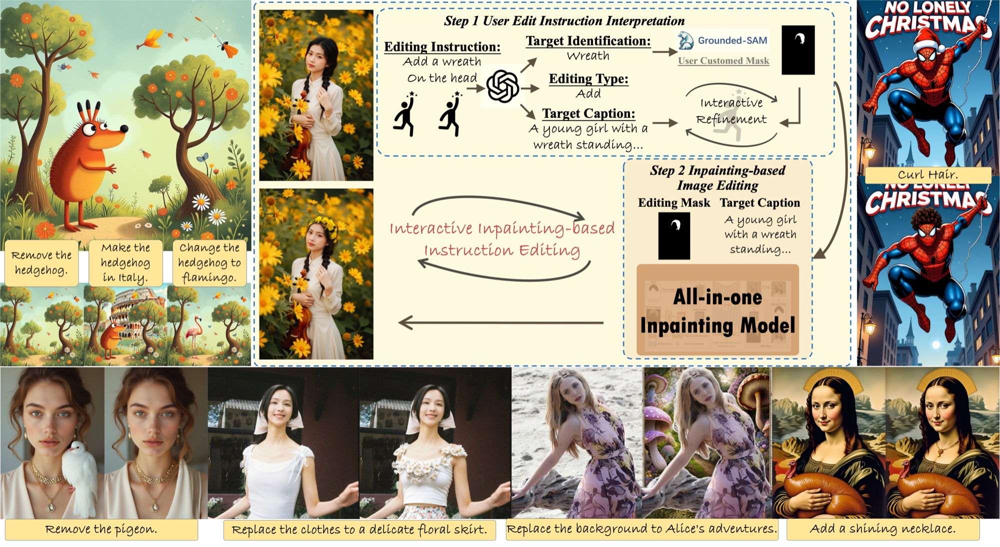
  </td>
  <td width="75%" valign="center">
    <papertitle>BrushEdit: All-In-One Image Inpainting and Editing</papertitle>
     
    Yaowei Li, Yuxuan Bian, Xuan Ju, Zhaoyang Zhang, <b>Junhao Zhuang</b>, Ying Shan, Yuexian Zou, Qiang Xu
     
    <em>IEEE Transactions on Pattern Analysis and Machine Intelligence (<strong>TPAMI</strong>), 2025</em>
     
    <a href="https://arxiv.org/abs/2412.10316">[PDF]</a> 
    <a href="https://liyaowei-stu.github.io/project/BrushEdit/">[Project Page]</a>
    <a href="https://github.com/TencentARC/BrushEdit">[Code]</a>
     
    
    
    
BrushEdit is an all-in-one image inpainting and editing framework that combines multimodal large language models (MLLMs) with the enhanced dual-branch diffusion inpainting model BrushNetX. It supports free-form instruction-guided interactive editing, achieves superior performance in background preservation and text alignment, and provides a user-friendly multi-round editing experience.

  </td>
</tr>

</tbody></table>

---

# 🏆 Honors & Awards
---
* Excellent Graduate, Tsinghua University
* Outstanding Master's Degree Thesis, Tsinghua University
* Comprehensive Excellence Scholarship, Tsinghua University (2024, 2025)
* Outstanding Bachelor's Degree Thesis, University of Electronic Science and Technology of China
* Outstanding Student Scholarship, University of Electronic Science and Technology of China (2020, 2021, 2022)

---

# 💼 Experience

**Kuaishou / KlingAI** — *Research Intern*  
Sep 2025 – Present  
Supervised by [Yunyao Mao](http://home.ustc.edu.cn/~myy2016/), [Xintao Wang](https://xinntao.github.io/)  
Topics: Video Generation

**Shanghai Artificial Intelligence Laboratory** — *Research Intern*  
May 2025 – Sep 2025  
Supervised by [Shi Guo](https://guoshi28.github.io/), [Tianfan Xue](https://tianfan.info/)  
Topics: Video Super-Resolution · Diffusion Acceleration · Sparse Attention

**Tencent, ARC Lab** — *Research Intern*  
May 2024 – Apr 2025  
Supervised by [Zhaoyang Zhang](https://zzyfd.github.io/#/), [Ying Shan](https://scholar.google.com/citations?user=4oXBp9UAAAAJ&hl=en)  
Topics: Comic Colorization · Video Generation · Diffusion

**Shanghai Artificial Intelligence Laboratory** — *Research Intern*  
Jul 2023 – Feb 2024  
Supervised by [Yanhong Zeng](https://zengyh1900.github.io/), [Kai Chen](https://scholar.google.com/citations?user=eGD0b7IAAAAJ&hl=en&oi=sra)  
Topics: Image Inpainting · Diffusion

---

# 🌎 Visitor Map

  

    
    <noscript>
      
    </noscript>
  

